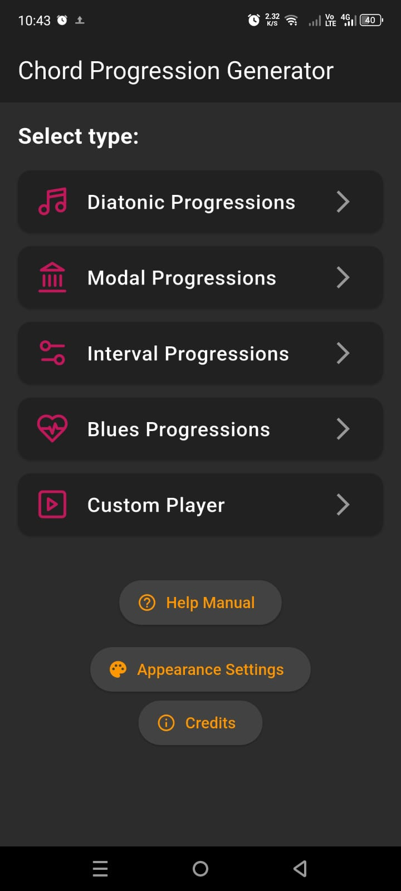

# 🎵 Chord Progression Generator

Una herramienta avanzada para músicos y compositores que va más allá de la teoría básica. Utiliza algoritmos probabilísticos para generar progresiones armónicas naturales, interesantes y complejas en múltiples sistemas musicales.

*(Asegúrate de subir esta imagen a una carpeta 'screenshots' en tu repo)*

## 🚀 Módulos Principales

La aplicación consta de 5 módulos especializados:

### 1. Progresiones Diatónicas
Genera secuencias dentro de una tonalidad específica respetando reglas armónicas tradicionales pero con giros interesantes.
* **Niveles de Complejidad:** Desde acordes naturales hasta **Intercambio Modal** y **Sustitución Tritonal**.
* **Resoluciones:** Soporte para secuencias II-V y dominantes secundarios.

### 2. Armonía Modal
Explora sonoridades fuera de la tonalidad mayor/menor.
* **Modos Soportados:** Jónico, Dórico, Frigio, Lidio, Mixolidio, Eólico, Locrio.
* **Algoritmo:** Tablas de transición probabilísticas únicas para cada modo.

### 3. Progresiones Interválicas
Un enfoque matemático-musical que construye secuencias basadas en saltos de intervalos dentro y entre células melódicas.

### 4. Blues Generator
Generación de estructuras de Blues tradicional y Jazz Blues, integrando cadenas de dominantes y variaciones rítmicas.

### 5. Custom Player
Editor flexible para escribir, pegar y reproducir tus propias progresiones. Permite guardar presets y probar ideas rápidamente.

---

## 📥 Descarga e Instalación

Puedes descargar la última versión del APK directamente desde la sección de **Releases** de este repositorio.

1.  Ve a [Releases](../../releases).
2.  Descarga el archivo `.apk`.
3.  Instálalo en tu dispositivo Android.

---

## 🛠️ Stack Tecnológico

* **Plataforma:** Android (Nativo).
* **Audio Engine:** Reproducción basada en SoundFonts para mayor realismo instrumental.
* **Lógica:** Algoritmos de probabilidad ponderada para transiciones armónicas.

---

> **Autor:** Raúl Héctor Cámara Carreón
